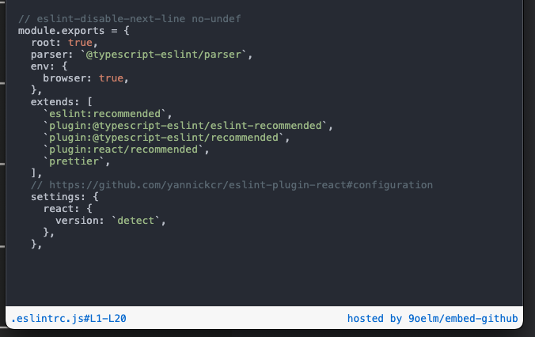

# embed-github



`embed-github` is a simple Cloudflare worker that fetches source code from any public Github repository, highlights the code in a HTML format and sends it back as a response.

Note that `embed-github` is a SSR application where the worker renders all HTML beforehand before sending the response, so the client will only see the website with minimal overhead. Zero external stylesheets or scripts.

## How to use

The safest and recommended way is to deploy your own `embed-github` to Cloudflare. Otherwise, you can use my own deployment of the worker at https://embed-github.lazer1.xyz. But the operational status of this worker is not always guaranteed because it will stay on the free plan.

So if you decide to deploy your own worker, that's great, because Cloudflare workers free plan offers 100K requests per day. It must be more than enough for an average user like most of us. Just sign up for Cloudflare, and `git clone` this repository, delete `routes` key at [`wrangler.toml`](./wrangler.toml), and run `npx wrangler deploy`. Then it should give you the URL at which this worker is deployed. Use that URL for your iframe.

This is how you would use it in your `iframe`:

```html
<iframe
  frameborder="0"
  style="width:100%; height:307px;"
  allow="clipboard-write"
  src="https://embed-github.lazer1.xyz?gh=https://github.com/graphcentral/notion/blob/70cd31090c324f36537c0f60160a4c22452f54e3/.eslintrc.js&lines=L1-L20"
></iframe>
```

### Available query parameters

1. `gh`:
   1. **[must be a GH permalink](https://docs.github.com/en/repositories/working-with-files/using-files/getting-permanent-links-to-files#press-y-to-permalink-to-a-file-in-a-specific-commit)**. Example: https://github.com/9oelM/embed-github/blob/18835668eb5495b7c5c6f0c893289b410e5f780f/README.md#L13-L13
   1. can be a value from `encodeURIComponent`, like: `https%3A%2F%2Fgithub.com%2F9oelM%2Fembed-github%2Fblob%2F18835668eb5495b7c5c6f0c893289b410e5f780f%2FREADME.md%23L13-L14`
2. `lines`:
   1. if `gh` parameter is a raw URL, then it must be in the format of `lines=L{number}-L{number}`. Example: `lines=L1-L10`. This is for convenience; When you don't want to run `encodeURIComponent` on the URL, just copy and paste, and change `#L13-L14` to `&lines=L13-L14`. Otherwise, `lines` parameter doesn't have to be specified at all. In this case, the entire file will be shown.
   1. if `gh` parameter is a value returned by `encodeURIComponent`, then the range of lines must have been included already in the URL as a fragment. `lines` parameter should not be provided again.
3. `theme`: changes the theme used for the code highlighting. See below for the list of available themes.
4. `lang`: override highlighting language. See below for the list of available languages.

Examples of valid requests:

- https://embed-github.lazer1.xyz?gh=https://github.com/graphcentral/notion/blob/70cd31090c324f36537c0f60160a4c22452f54e3/.eslintrc.js&lines=L1-L20
- https://embed-github.lazer1.xyz?gh=https%3A%2F%2Fgithub.com%2Fgraphcentral%2Fnotion%2Fblob%2F70cd31090c324f36537c0f60160a4c22452f54e3%2F.eslintrc.js%23L1-L20
- https://embed-github.lazer1.xyz?gh=https%3A%2F%2Fgithub.com%2Fgraphcentral%2Fnotion%2Fblob%2F70cd31090c324f36537c0f60160a4c22452f54e3%2F.eslintrc.js
- https://embed-github.lazer1.xyz?gh=https://github.com/graphcentral/notion/blob/70cd31090c324f36537c0f60160a4c22452f54e3/.eslintrc.js
- https://embed-github.lazer1.xyz?gh=https://github.com/graphcentral/notion/blob/70cd31090c324f36537c0f60160a4c22452f54e3/.eslintrc.js&theme=Solarized%20(dark)
- https://embed-github.lazer1.xyz?gh=https%3A%2F%2Fgithub.com%2Fgraphcentral%2Fnotion%2Fblob%2F70cd31090c324f36537c0f60160a4c22452f54e3%2F.eslintrc.js%23L1-L20&theme=base16-mocha.dark

## Using a theme

Use the `theme` query parameter to change the theme, like: `https://myworker.url?theme=Solarized%20(dark)`. Here's the list of all available themes:

```
"InspiredGitHub"
"Solarized (dark)"
"Solarized (light)"
"base16-eighties.dark"
"base16-mocha.dark"
"base16-ocean.dark"
"base16-ocean.light"
```

The list of available themes is directly dependent on the underlying library [`syntect`](https://github.com/trishume/syntect/)'s `ThemeSet::load_defaults()`. If you want to add your own theme, you need to start from there.

## Using a language

Any of the file extensions below can be used as a `lang` query parameter to override automatic file extension detection.

```
"txt"
"asa"
"asp"
"as"
"applescript", "script editor"
"bat", "cmd"
"build"
"cs", "csx"
"cpp", "cc", "cp", "cxx", "c++", "C", "h", "hh", "hpp", "hxx", "h++", "inl", "ipp"
"c", "h"
"css", "css.erb", "css.liquid"
"clj"
"d", "di"
"diff", "patch"
"erl", "hrl", "Emakefile", "emakefile"
"yaws"
"go"
"dot", "DOT", "gv"
"groovy", "gvy", "gradle"
"html", "htm", "shtml", "xhtml", "inc", "tmpl", "tpl"
"hs"
"lhs"
"jsp"
"java", "bsh"
"properties"
"json", "sublime-settings", "sublime-menu", "sublime-keymap", "sublime-mousemap", "sublime-theme", "sublime-build", "sublime-project", "sublime-completions", "sublime-commands", "sublime-macro", "sublime-color-scheme"
"js", "htc"
"bib"
"tex", "ltx"
"sty", "cls"
"lisp", "cl", "clisp", "l", "mud", "el", "scm", "ss", "lsp", "fasl"
"lua"
"make", "GNUmakefile", "makefile", "Makefile", "OCamlMakefile", "mak", "mk"
"md", "mdown", "markdown", "markdn"
"matlab"
"ml", "mli"
"mll"
"mly"
"mm", "M", "h"
"m", "h"
"php", "php3", "php4", "php5", "php7", "phps", "phpt", "phtml"
"pas", "p", "dpr"
"pl", "pm", "pod", "t", "PL"
"py", "py3", "pyw", "pyi", "pyx", "pyx.in", "pxd", "pxd.in", "pxi", "pxi.in", "rpy", "cpy", "SConstruct", "Sconstruct", "sconstruct", "SConscript", "gyp", "gypi", "Snakefile", "wscript"
"R", "r", "s", "S", "Rprofile"
"rd"
"rails", "rhtml", "erb", "html.erb"
"js.erb"
"haml", "sass"
"rxml", "builder"
"erbsql", "sql.erb"
"re"
"rst", "rest"
"rb", "Appfile", "Appraisals", "Berksfile", "Brewfile", "capfile", "cgi", "Cheffile", "config.ru", "Deliverfile", "Fastfile", "fcgi", "Gemfile", "gemspec", "Guardfile", "irbrc", "jbuilder", "podspec", "prawn", "rabl", "rake", "Rakefile", "Rantfile", "rbx", "rjs", "ruby.rail", "Scanfile", "simplecov", "Snapfile", "thor", "Thorfile", "Vagrantfile"
"rs"
"sql", "ddl", "dml"
"scala", "sbt"
"sh", "bash", "zsh", "fish", ".bash_aliases", ".bash_completions", ".bash_functions", ".bash_login", ".bash_logout", ".bash_profile", ".bash_variables", ".bashrc", ".profile", ".textmate_init"
"adp"
"tcl"
"textile"
"xml", "xsd", "xslt", "tld", "dtml", "rss", "opml", "svg"
"yaml", "yml", "sublime-syntax"
```

## Todos

1. Adjustable font size & line height
1. Random 500 errors (probably will be resolved once we have the first todo resolved) when many requests are sent at the same time. Reason is still unknown.
1. Webpage like https://emgithub.com/ where users can preview their iframe

## Contributing

Have the latest version of Rust installed. The default toolchain is **nightly**.

Run:

```
npx wrangler -e dev dev
```

to start a local development environment. Access the worker at http://localhost:8787.

Just fork the repo, make changes, and make a PR from your branch at your fork.
