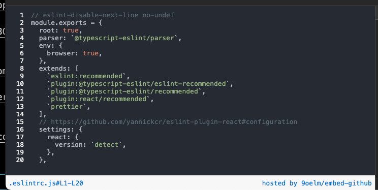

# embed-github

`embed-github` is a simple Cloudflare worker that fetches source code from any public Github repository, highlights the code in a HTML format and sends it back as a response.

Note that `embed-github` is a SSR application where the worker renders all HTML beforehand before sending the response, so the client will only see the website with minimal overhead.

## How to use

The safest and recommended way is to deploy your own `embed-github` to Cloudflare. Otherwise, you can use my own deployment of the worker at https://embed-github.lazer1.xyz. But the operational status of this worker is not always guaranteed because it will stay on the free plan.

Cloudflare workers free plan offers 100K requests per day, so it must be more than okay for an average user.

Just sign up for Cloudflare, and `git clone` this repository, and run `npx wrangler deploy`. Then it should give you the URL at which this worker is deployed. Use that URL for your iframe.

Then, use it in your `iframe`:

```html
<iframe
  frameborder="0"
  scrolling="no"
  style="width:100%; height:307px;"
  allow="clipboard-write"
  src="https://embed-github.lazer1.xyz?gh=https://github.com/graphcentral/notion/blob/70cd31090c324f36537c0f60160a4c22452f54e3/.eslintrc.js&lines=L1-L20"
></iframe>
```

Then it will show an iframe like:



### Available query parameters

1. `gh`:
   1. **[must be a GH permalink](https://docs.github.com/en/repositories/working-with-files/using-files/getting-permanent-links-to-files#press-y-to-permalink-to-a-file-in-a-specific-commit)**. Example: https://github.com/9oelM/embed-github/blob/18835668eb5495b7c5c6f0c893289b410e5f780f/README.md#L13-L13
   1. can be a value from `encodeURIComponent`, like: `https%3A%2F%2Fgithub.com%2F9oelM%2Fembed-github%2Fblob%2F18835668eb5495b7c5c6f0c893289b410e5f780f%2FREADME.md%23L13-L14`
2. `lines`:
   1. if `gh` parameter is a raw URL, then it must be in the format of `lines=L{number}-L{number}`. Example: `lines=L1-L10`. This is for convenience; When you don't want to run `encodeURIComponent` on the URL, just copy and paste, and change `#L13-L14` to `&lines=L13-L14`. Otherwise, `lines` parameter doesn't have to be specified at all. In this case, the entire file will be shown.
   1. if `gh` parameter is a value returned by `encodeURIComponent`, then the range of lines must have been included already in the URL as a fragment. `lines` parameter should not be provided again.
3. `theme`: changes the theme used for the code highlighting. See below for the list of available themes.

Examples of valid requests:

- https://embed-github.lazer1.xyz?gh=https://github.com/graphcentral/notion/blob/70cd31090c324f36537c0f60160a4c22452f54e3/.eslintrc.js&lines=L1-L20
- https://embed-github.lazer1.xyz?gh=https%3A%2F%2Fgithub.com%2Fgraphcentral%2Fnotion%2Fblob%2F70cd31090c324f36537c0f60160a4c22452f54e3%2F.eslintrc.js%23L1-L20
- https://embed-github.lazer1.xyz?gh=https%3A%2F%2Fgithub.com%2Fgraphcentral%2Fnotion%2Fblob%2F70cd31090c324f36537c0f60160a4c22452f54e3%2F.eslintrc.js
- https://embed-github.lazer1.xyz?gh=https://github.com/graphcentral/notion/blob/70cd31090c324f36537c0f60160a4c22452f54e3/.eslintrc.js
- https://embed-github.lazer1.xyz?gh=https://github.com/graphcentral/notion/blob/70cd31090c324f36537c0f60160a4c22452f54e3/.eslintrc.js&theme=Solarized%20(dark)
- https://embed-github.lazer1.xyz?gh=https%3A%2F%2Fgithub.com%2Fgraphcentral%2Fnotion%2Fblob%2F70cd31090c324f36537c0f60160a4c22452f54e3%2F.eslintrc.js%23L1-L20&theme=base16-mocha.dark

## Using a theme

Use the `theme` query parameter to change the theme, like: `https://myworker.url?theme=Solarized%20(dark)`. Here's the list of all available themes:

```
"InspiredGitHub"
"Solarized (dark)"
"Solarized (light)"
"base16-eighties.dark"
"base16-mocha.dark"
"base16-ocean.dark"
"base16-ocean.light"
```

The list of available themes is directly dependent on the underlying library [`syntect`](https://github.com/trishume/syntect/)'s `ThemeSet::load_defaults()`. If you want to add your own theme, you need to start from there.
